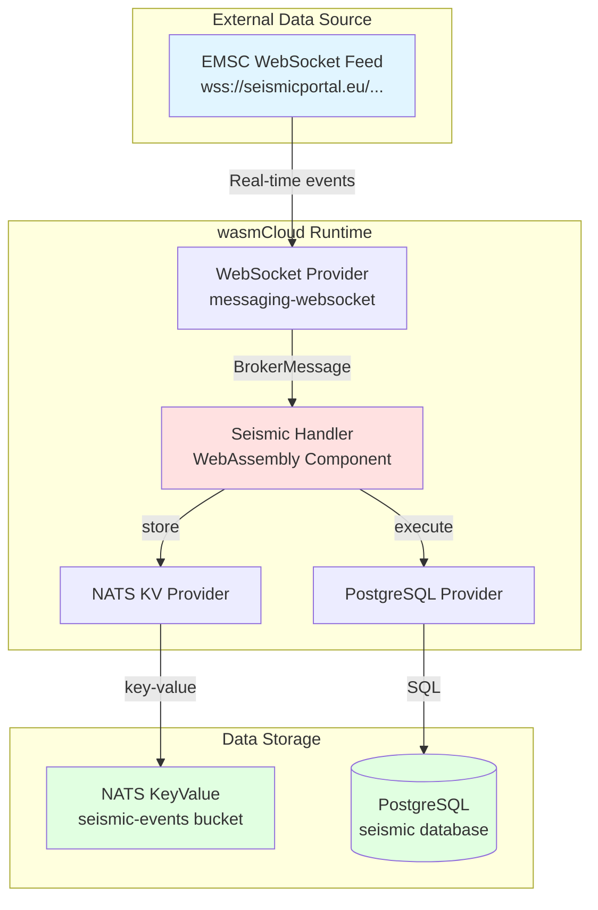
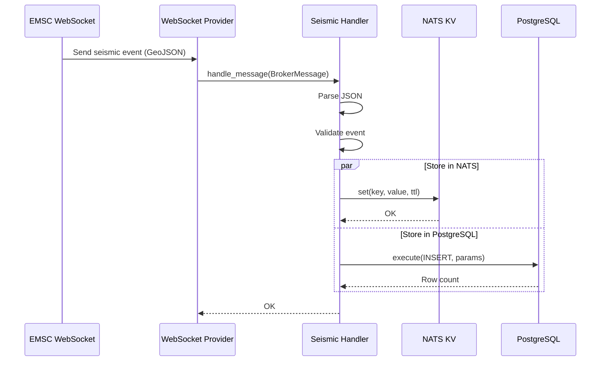
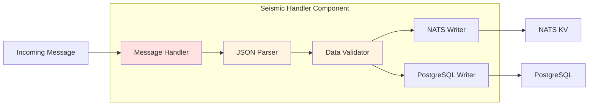
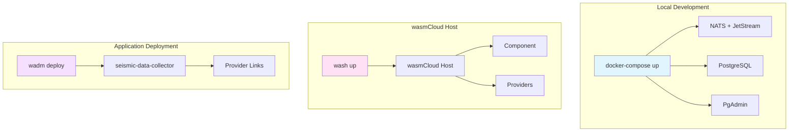
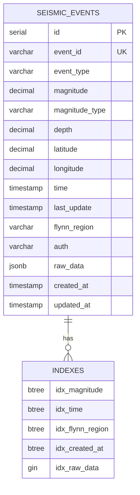
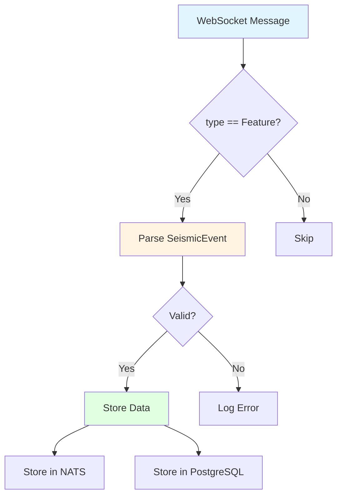
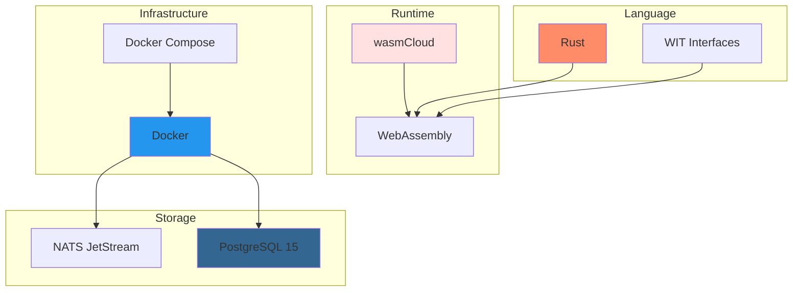
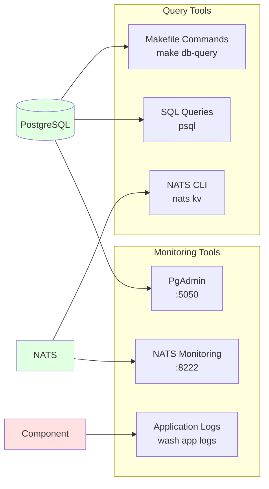
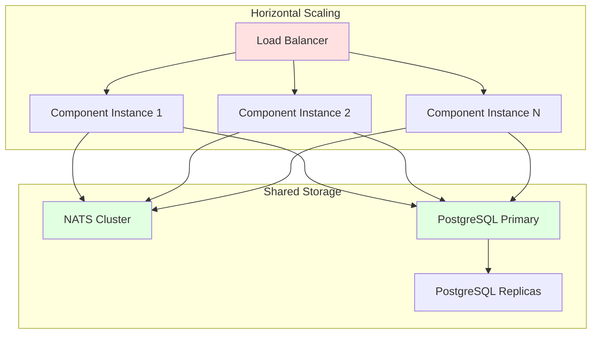
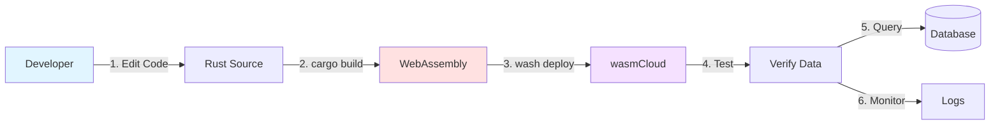

# Architecture Diagrams

This document contains visual representations of the Seismic Data Collector architecture.

## High-Level Architecture



## Data Flow



## Component Architecture



## Deployment Architecture



## Data Storage Schema



## Message Format



## GeoJSON Event Structure

```json
{
  "type": "Feature",
  "id": "20231120_0000012",
  "properties": {
    "lastupdate": "2023-11-20T12:34:56",
    "mag": 5.2,
    "magtype": "mww",
    "time": "2023-11-20T12:00:00",
    "flynn_region": "EASTERN MEDITERRANEAN SEA",
    "auth": "EMSC",
    "depth": 10.0
  },
  "geometry": {
    "type": "Point",
    "coordinates": [35.0, 36.0]
  }
}
```

## Technology Stack



## Monitoring & Querying



## Scaling Strategy



## Development Workflow



## Folder Structure

```
Sesmic-dots/
├── seismic-handler/           # WebAssembly component
│   ├── Cargo.toml            # Rust dependencies
│   ├── src/
│   │   └── lib.rs            # Component implementation
│   └── wit/
│       ├── world.wit         # Interface definitions
│       └── deps/             # Provider interfaces
├── config/                    # Configuration files
│   ├── schema.sql            # Database schema
│   ├── sample-queries.sql    # Example queries
│   └── host-config.yaml      # wasmCloud config
├── wadm.yaml                 # Application manifest
├── docker-compose.yml        # Infrastructure setup
├── Makefile                  # Build automation
├── deploy.sh                 # Deployment script
├── test_data_generator.py    # Test data tool
└── docs/                     # Documentation
    ├── README.md
    ├── QUICKSTART.md
    ├── ARCHITECTURE.md
    └── SUMMARY.md
```
